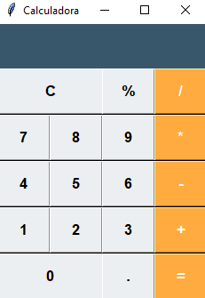

🧮 Multi Platform Calculator
Python (Tkinter) + Web (HTML, CSS, JavaScript)

Projeto de calculadora desenvolvido em duas plataformas diferentes, com foco em prática de lógica de programação e desenvolvimento de interfaces gráficas e web.

🌍 Acesse a Versão Online

🔗 Use diretamente no navegador:
👉 https://lucas1308233.github.io/Multi_Platform-Calculator-Python-Web-/

✔ Não precisa instalar nada
✔ Funciona em qualquer navegador moderno

🖥️ Versão Desktop (Python + Tkinter)
📌 Requisitos

Python 3 instalado
Download oficial: https://www.python.org/downloads/

▶ Como executar localmente

1️⃣ Clone o repositório:

git clone https://github.com/lucas1308233/Multi_Platform-Calculator-Python-Web-.git

2️⃣ Entre na pasta do projeto:

cd Multi_Platform-Calculator-Python-Web-

3️⃣ Execute o programa:

python calculadora.py

A interface gráfica será aberta automaticamente.

🚀 Tecnologias Utilizadas

Python 3

Tkinter

HTML5

CSS3

JavaScript (ES6)

📌 Funcionalidades

✔ Operações básicas (+, −, ×, ÷)
✔ Cálculo de porcentagem (%)
✔ Interface moderna e alinhada
✔ Versão Web responsiva
✔ Versão Desktop com interface gráfica

🎯 Objetivo do Projeto

Este projeto foi desenvolvido com o objetivo de:

Praticar lógica de programação

Desenvolver interfaces gráficas com Tkinter

Criar uma versão web interativa

Aplicar versionamento com Git e GitHub

Publicar aplicação com GitHub Pages

📷 Demonstração

Você pode adicionar aqui uma imagem da calculadora funcionando.

Exemplo:

(Se quiser eu te ensino a tirar um print bonito e deixar profissional.)

👨‍💻 Autor

Desenvolvido por Lucas